<div align="center">

  <!-- Animated Pure SVG Terminal Header -->
  

  <br />

  <h1>Hi there, I'm <span style="color: #00F0FF;">Stoy</span> 👋</h1>

  <p>
    <a href="https://github.com/stoy"></a>
  </p>

</div>

---

### ⚡ About Me

```zsh
$ cat bio.json
{
  "name": "Stoy",
  "location": "Indonesia",
  "hobbies": ["Tinkering with Tech"],
}
```

---


### 📊 GitHub Telemetry

<div align="center">
  
  
</div>
